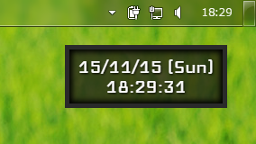
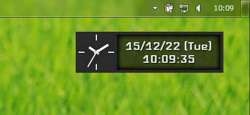

# tutorial_clock
Electronによる、シンプルな時計ウィジェット

**リンク先準備中です**

## app
  
[Electronでデスクトップウィジェットを作るまで - Qiita](http://qiita.com/SallyAcolyte/items/94ed26ab62b8b32b1b2c)用のサンプルプログラム

ダウンロード: [tutorial_clock_app.zip](https://github.com/SallyAcolyte/tutorial_clock/releases/download/0.0.1/tutorial_clock_app.zip)

## app_option
  
appにアナログ時計を追加したもの

ダウンロード: [tutorial_clock_app_option.zip](https://github.com/SallyAcolyte/tutorial_clock/releases/download/0.0.1/tutorial_clock_app_option.zip)
